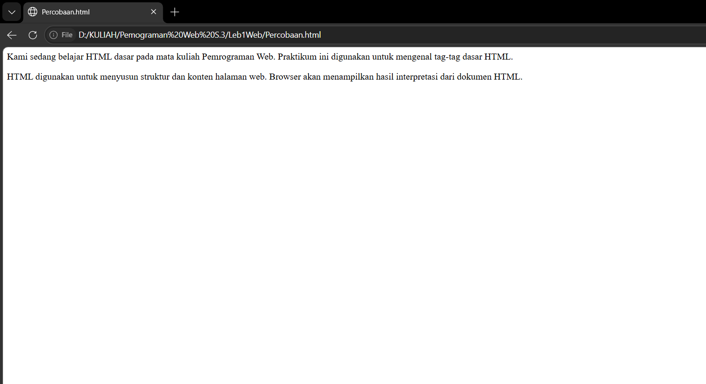

# Lab1Web

Repository ini berisi hasil praktikum Pertemuan 3 pemograman web.

## 1. Membuat Paragraf

Pada tahap ini Kita belajar cara membuat sebuah paragraf menggunakan HTML.

### Hasil

---

## 2. Menambahkan Judul

Pada tahap ini kita belajar menambahkan heading, dan melalukakn uji coba untuk melihat perbedaan antara h1 dan h2.

### Hasil

---

## 3. Memformat teks

Pada tahap ini mempelajari bagaimanan cara memformat teks di dalam HTML.

### Hasil

---

## 4. Menyisipkan gambar
Pada tahap ini mempelajari bagaimanan menyisipkan gambar pada HTML.

### Hasil

---

## 5. Mengatur Ukuran Gambar
Untuk mengatur ukuran gambar dapat digunakan atribut width dan height.

### Hasil

---

## 6. Menambahkan Hyperlink
Pada tahap ini mempelajari cara membuat hyperlink

### Hasil

---

## 7. Menambahkan List
Pada tahap ini mempelajari cara menambahkan list pada HTML.

### Hasil

---

## 8. Kesimpulan

Pada praktikum ini saya mempelajari dasar-dasar pembuatan halaman web
menggunakan HTML, mulai dari membuat struktur dokumen HTML, heading,
paragraph, hyperlink, mennyisipkan gambar, membuat list dan mengatur ukuran gambar.

